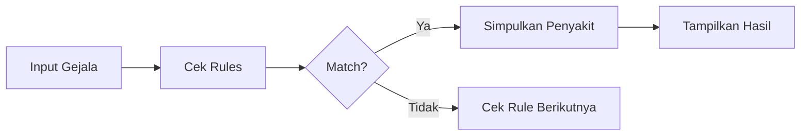
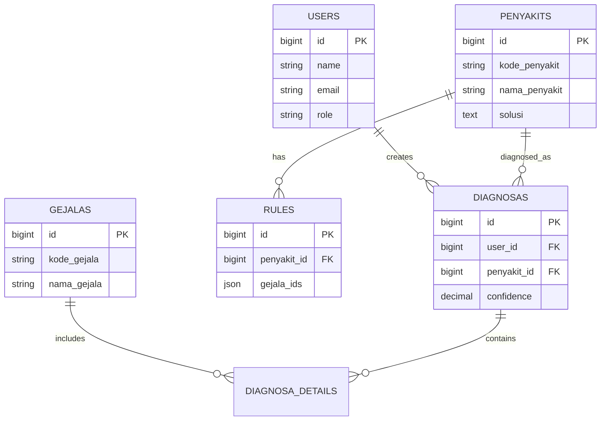
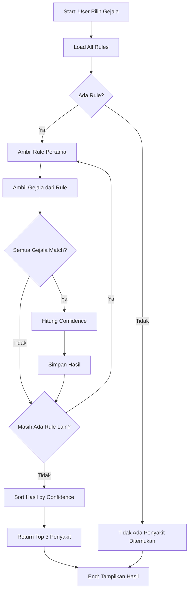

# 🐄 Sistem Pakar Diagnosa Penyakit Sapi

<p align="center">
  
</p>

<p align="center">
  
  
  
  
</p>

---

## 📋 Deskripsi Proyek

**Sistem Pakar Diagnosa Penyakit Sapi** adalah aplikasi web berbasis Laravel yang dirancang untuk membantu peternak dan dokter hewan dalam mendiagnosa penyakit pada sapi secara cepat dan akurat.

Sistem ini menggunakan metode **Forward Chaining** untuk menganalisis gejala-gejala yang dialami sapi, kemudian memberikan diagnosis penyakit beserta rekomendasi tindakan pengobatan yang tepat.

### ✨ Keunggulan Sistem

- 🔍 **Diagnosis Otomatis** - Analisis gejala dengan algoritma forward chaining
- 📊 **Dashboard Interaktif** - Visualisasi data yang informatif dan user-friendly
- 🗃️ **Basis Pengetahuan** - Database lengkap penyakit dan gejala sapi
- 📝 **Riwayat Diagnosa** - Tracking dan monitoring hasil diagnosa
- 🔐 **Sistem Keamanan** - Autentikasi dan otorisasi pengguna
- 📱 **Responsive Design** - Dapat diakses dari berbagai perangkat

---

## 🎯 Fitur Utama

### 1️⃣ Manajemen Data Master

#### 🩺 Manajemen Gejala
- **Create**: Menambah data gejala baru yang bisa dialami sapi
- **Read**: Melihat daftar semua gejala yang tersedia
- **Update**: Mengubah informasi gejala yang sudah ada
- **Delete**: Menghapus gejala yang tidak relevan

**Atribut Gejala:**
- Kode Gejala (G001, G002, dst)
- Nama Gejala
- Deskripsi lengkap

#### 🦠 Manajemen Penyakit
- **Create**: Menambah data penyakit baru
- **Read**: Melihat daftar semua penyakit
- **Update**: Mengubah informasi penyakit
- **Delete**: Menghapus data penyakit

**Atribut Penyakit:**
- Kode Penyakit (P001, P002, dst)
- Nama Penyakit
- Deskripsi/Penjelasan
- Solusi/Pengobatan
- Tingkat Keparahan

#### 🧬 Basis Pengetahuan (Rules)
Mendefinisikan relasi antara gejala dan penyakit menggunakan aturan IF-THEN:

```
IF Gejala A AND Gejala B AND Gejala C
THEN Penyakit X
```

**Fitur:**
- Tambah aturan baru (penyakit + gejala-gejala terkait)
- Edit aturan yang sudah ada
- Hapus aturan yang tidak valid
- Lihat semua aturan dalam basis pengetahuan

---

### 2️⃣ Sistem Diagnosa

#### 🔬 Proses Diagnosa
1. **Input Gejala**: User memilih gejala-gejala yang dialami sapi
2. **Analisis Forward Chaining**: Sistem memproses gejala dengan algoritma
3. **Hasil Diagnosa**: Sistem menampilkan penyakit yang terdeteksi
4. **Rekomendasi**: Menampilkan solusi pengobatan yang disarankan

#### 📊 Metode Forward Chaining
Forward Chaining adalah metode inferensi yang bekerja dari fakta ke kesimpulan:



**Algoritma:**
1. Ambil semua gejala yang dipilih user
2. Cari rule yang cocok dengan kombinasi gejala
3. Jika semua gejala dalam rule terpenuhi, penyakit ditemukan
4. Hitung confidence level berdasarkan jumlah gejala cocok
5. Urutkan hasil berdasarkan tingkat kepercayaan

---

### 3️⃣ Dashboard & Laporan

#### 📈 Dashboard Admin
- **Statistik Sistem**:
  - Total Penyakit Terdaftar
  - Total Gejala Terdaftar
  - Total Rules/Basis Pengetahuan
  - Jumlah Diagnosa Hari Ini
  
- **Grafik & Visualisasi**:
  - Grafik penyakit paling sering terdiagnosa
  - Trend diagnosa per bulan
  - Tingkat akurasi sistem

#### 📜 Riwayat Diagnosa
- Melihat semua hasil diagnosa yang pernah dilakukan
- Filter berdasarkan tanggal, penyakit, atau user
- Export ke PDF/Excel
- Detail setiap diagnosa (gejala, hasil, waktu)

---

### 4️⃣ Manajemen User

#### 👥 Autentikasi & Otorisasi
- **Login/Logout**: Sistem login untuk keamanan
- **Role Management**:
  - **Admin**: Akses penuh semua fitur
  - **User/Peternak**: Akses diagnosa dan riwayat

#### 🔑 Fitur Keamanan
- Password encryption (bcrypt)
- Session management
- CSRF protection
- Input validation & sanitization

---

## 🛠️ Teknologi & Tools

### Backend
| Teknologi | Versi | Fungsi |
|-----------|-------|--------|
|  | 12.x | Framework PHP |
|  | 8.2+ | Programming Language |
|  | 8.0+ | Database |

### Frontend
| Teknologi | Fungsi |
|-----------|--------|
|  | Template Engine |
|  | CSS Framework |
|  | JavaScript Framework |
|  | UI Components |

### Development Tools
- **Composer** - Dependency Manager PHP
- **NPM** - Package Manager JavaScript
- **Vite** - Frontend Build Tool
- **Git** - Version Control

---

## 📦 Instalasi & Konfigurasi

### ⚙️ Requirements
Pastikan sistem Anda sudah terinstall:
- PHP >= 8.2
- Composer
- MySQL >= 8.0
- Node.js & NPM
- Git

### 🚀 Langkah Instalasi

#### 1. Clone Repository
```bash
git clone https://github.com/Suprapto-23/sistem-pakar-sapi.git
cd sistem-pakar-sapi
```

#### 2. Install Dependencies
```bash
# Install PHP dependencies
composer install

# Install JavaScript dependencies
npm install
```

#### 3. Konfigurasi Environment
```bash
# Copy file environment
cp .env.example .env

# Generate application key
php artisan key:generate
```

#### 4. Konfigurasi Database

##### a. Buat Database di MySQL
```sql
-- Buka MySQL/phpMyAdmin
CREATE DATABASE sistem_pakar_sapi;
```

##### b. Konfigurasi `.env`
```env
APP_NAME="Sistem Pakar Sapi"
APP_ENV=local
APP_KEY=base64:xxx # sudah di-generate
APP_DEBUG=true
APP_URL=http://localhost

DB_CONNECTION=mysql
DB_HOST=127.0.0.1
DB_PORT=3306
DB_DATABASE=sistem_pakar_sapi
DB_USERNAME=root
DB_PASSWORD=
```

#### 5. Migrasi & Seeding Database

##### Opsi A: Menggunakan Migration & Seeder
```bash
# Jalankan migration
php artisan migrate

# Jalankan seeder (jika ada)
php artisan db:seed
```

##### Opsi B: Import Database SQL (Jika Ada File .sql)
```bash
# Via MySQL Command
mysql -u root -p sistem_pakar_sapi < database/backup.sql

# Atau via phpMyAdmin:
# 1. Buka phpMyAdmin
# 2. Pilih database 'sistem_pakar_sapi'
# 3. Tab "Import"
# 4. Pilih file .sql
# 5. Klik "Go"
```

#### 6. Setup Storage & Permissions
```bash
# Create symbolic link untuk storage
php artisan storage:link

# Set permissions (Linux/Mac)
chmod -R 775 storage bootstrap/cache
```

#### 7. Build Frontend Assets
```bash
# Development
npm run dev

# Production
npm run build
```

#### 8. Jalankan Aplikasi
```bash
# Start development server
php artisan serve

# Aplikasi berjalan di: http://localhost:8000
```

---

## 📁 Struktur Proyek

```
sistem-pakar-sapi/
│
├── app/
│   ├── Http/
│   │   ├── Controllers/
│   │   │   ├── Auth/
│   │   │   │   ├── LoginController.php
│   │   │   │   └── RegisterController.php
│   │   │   ├── Admin/
│   │   │   │   ├── DashboardController.php
│   │   │   │   ├── GejalaController.php
│   │   │   │   ├── PenyakitController.php
│   │   │   │   ├── RuleController.php
│   │   │   │   └── UserController.php
│   │   │   ├── DiagnosaController.php
│   │   │   └── RiwayatController.php
│   │   │
│   │   └── Middleware/
│   │       ├── AdminMiddleware.php
│   │       └── UserMiddleware.php
│   │
│   ├── Models/
│   │   ├── User.php
│   │   ├── Gejala.php
│   │   ├── Penyakit.php
│   │   ├── Rule.php
│   │   ├── Diagnosa.php
│   │   └── DiagnosaDetail.php
│   │
│   └── Services/
│       └── ForwardChainingService.php  # Logic algoritma
│
├── database/
│   ├── migrations/
│   │   ├── 2024_xx_create_users_table.php
│   │   ├── 2024_xx_create_gejalas_table.php
│   │   ├── 2024_xx_create_penyakits_table.php
│   │   ├── 2024_xx_create_rules_table.php
│   │   └── 2024_xx_create_diagnosas_table.php
│   │
│   └── seeders/
│       ├── UserSeeder.php
│       ├── GejalaSeeder.php
│       ├── PenyakitSeeder.php
│       └── RuleSeeder.php
│
├── resources/
│   ├── views/
│   │   ├── layouts/
│   │   │   ├── app.blade.php
│   │   │   ├── admin.blade.php
│   │   │   └── guest.blade.php
│   │   │
│   │   ├── auth/
│   │   │   ├── login.blade.php
│   │   │   └── register.blade.php
│   │   │
│   │   ├── admin/
│   │   │   ├── dashboard.blade.php
│   │   │   ├── gejala/
│   │   │   │   ├── index.blade.php
│   │   │   │   ├── create.blade.php
│   │   │   │   └── edit.blade.php
│   │   │   ├── penyakit/
│   │   │   ├── rule/
│   │   │   └── user/
│   │   │
│   │   ├── diagnosa/
│   │   │   ├── index.blade.php
│   │   │   └── hasil.blade.php
│   │   │
│   │   └── riwayat/
│   │       └── index.blade.php
│   │
│   └── css/
│       └── app.css
│
├── routes/
│   ├── web.php      # Routing aplikasi
│   └── api.php      # API routes (jika ada)
│
├── public/
│   ├── css/
│   ├── js/
│   └── images/
│
├── .env.example      # Template environment
├── composer.json     # PHP dependencies
├── package.json      # JS dependencies
└── README.md
```

---

## 🗃️ Struktur Database

### Tabel: `users`
```sql
id              BIGINT (PK, Auto Increment)
name            VARCHAR(255)
email           VARCHAR(255) UNIQUE
password        VARCHAR(255)
role            ENUM('admin', 'user')
created_at      TIMESTAMP
updated_at      TIMESTAMP
```

### Tabel: `gejalas` (Gejala)
```sql
id              BIGINT (PK, Auto Increment)
kode_gejala     VARCHAR(10) UNIQUE  # G001, G002, dst
nama_gejala     VARCHAR(255)
deskripsi       TEXT
created_at      TIMESTAMP
updated_at      TIMESTAMP
```

### Tabel: `penyakits` (Penyakit)
```sql
id              BIGINT (PK, Auto Increment)
kode_penyakit   VARCHAR(10) UNIQUE  # P001, P002, dst
nama_penyakit   VARCHAR(255)
deskripsi       TEXT
solusi          TEXT                 # Pengobatan/solusi
tingkat_bahaya  ENUM('Ringan', 'Sedang', 'Berat')
created_at      TIMESTAMP
updated_at      TIMESTAMP
```

### Tabel: `rules` (Basis Pengetahuan)
```sql
id              BIGINT (PK, Auto Increment)
penyakit_id     BIGINT (FK -> penyakits.id)
gejala_ids      JSON                 # Array ID gejala [1,2,3,4]
confidence      DECIMAL(5,2)         # Tingkat kepercayaan
created_at      TIMESTAMP
updated_at      TIMESTAMP
```

### Tabel: `diagnosas` (Hasil Diagnosa)
```sql
id              BIGINT (PK, Auto Increment)
user_id         BIGINT (FK -> users.id)
nama_peternak   VARCHAR(255)
nama_sapi       VARCHAR(255)
umur_sapi       INT
penyakit_id     BIGINT (FK -> penyakits.id)
confidence      DECIMAL(5,2)
tanggal         DATE
created_at      TIMESTAMP
updated_at      TIMESTAMP
```

### Tabel: `diagnosa_details` (Detail Gejala Diagnosa)
```sql
id              BIGINT (PK, Auto Increment)
diagnosa_id     BIGINT (FK -> diagnosas.id)
gejala_id       BIGINT (FK -> gejalas.id)
created_at      TIMESTAMP
updated_at      TIMESTAMP
```

### Relasi Database


---

## 🔧 Logic & Algoritma

### Forward Chaining Algorithm

#### Konsep Dasar
Forward Chaining adalah metode reasoning yang dimulai dari **fakta yang diketahui** (gejala) menuju **kesimpulan** (penyakit).

#### Pseudocode
```
FUNCTION forward_chaining(selected_symptoms):
    results = []
    
    FOR EACH rule IN knowledge_base:
        rule_symptoms = rule.gejala_ids
        match_count = 0
        
        FOR EACH symptom IN rule_symptoms:
            IF symptom IN selected_symptoms:
                match_count += 1
        
        IF match_count == length(rule_symptoms):
            # Semua gejala cocok = penyakit ditemukan
            confidence = (match_count / total_symptoms) * 100
            results.append({
                'penyakit': rule.penyakit,
                'confidence': confidence,
                'matched_symptoms': match_count
            })
    
    # Sort by confidence descending
    results = sort_by_confidence(results)
    
    RETURN results
```

#### Implementasi di Laravel (Service)
```php
// app/Services/ForwardChainingService.php

namespace App\Services;

class ForwardChainingService
{
    public function diagnose(array $selectedGejalas)
    {
        $rules = Rule::with('penyakit')->get();
        $results = [];

        foreach ($rules as $rule) {
            $ruleGejalas = json_decode($rule->gejala_ids);
            $matchCount = 0;

            foreach ($ruleGejalas as $gejalaId) {
                if (in_array($gejalaId, $selectedGejalas)) {
                    $matchCount++;
                }
            }

            // Jika semua gejala di rule cocok dengan input
            if ($matchCount == count($ruleGejalas)) {
                $confidence = ($matchCount / count($selectedGejalas)) * 100;
                
                $results[] = [
                    'penyakit' => $rule->penyakit,
                    'matched_count' => $matchCount,
                    'confidence' => round($confidence, 2)
                ];
            }
        }

        // Sort by confidence
        usort($results, function($a, $b) {
            return $b['confidence'] <=> $a['confidence'];
        });

        return $results;
    }
}
```

#### Flow Diagram


---

## 🎨 Tampilan & UI

### 1. Halaman Login
```
┌────────────────────────────────────┐
│   🐄 SISTEM PAKAR PENYAKIT SAPI    │
│                                    │
│   ┌──────────────────────────┐    │
│   │ Email    [____________]  │    │
│   │ Password [____________]  │    │
│   │                          │    │
│   │     [ LOGIN ]            │    │
│   └──────────────────────────┘    │
│                                    │
│   Belum punya akun? Daftar        │
└────────────────────────────────────┘
```

### 2. Dashboard Admin
```
┌────────────────────────────────────────────────┐
│  Dashboard                           [Admin] ▼│
├────────────────────────────────────────────────┤
│                                                │
│  ┌─────────┐ ┌─────────┐ ┌─────────┐         │
│  │ 25      │ │ 45      │ │ 120     │         │
│  │ Penyakit│ │ Gejala  │ │ Rules   │         │
│  └─────────┘ └─────────┘ └─────────┘         │
│                                                │
│  📊 Grafik Diagnosa (Bar Chart)               │
│  ┌──────────────────────────────────────┐     │
│  │ ████                                 │     │
│  │ ██████                               │     │
│  │ ████████                             │     │
│  └──────────────────────────────────────┘     │
│                                                │
│  Menu:                                        │
│  ⚙️ Kelola Gejala | 🦠 Kelola Penyakit       │
│  📋 Basis Pengetahuan | 👥 Kelola User       │
└────────────────────────────────────────────────┘
```

### 3. Form Diagnosa
```
┌────────────────────────────────────────────────┐
│  Diagnosa Penyakit Sapi                       │
├────────────────────────────────────────────────┤
│                                                │
│  Data Sapi:                                   │
│  Nama Peternak: [________________]            │
│  Nama Sapi:     [________________]            │
│  Umur:          [____] tahun                  │
│                                                │
│  Pilih Gejala yang Dialami:                  │
│  ☐ Demam tinggi                               │
│  ☐ Nafsu makan menurun                        │
│  ☐ Diare                                      │
│  ☐ Batuk-batuk                                │
│  ☐ Lemas                                      │
│  ... (daftar gejala lainnya)                  │
│                                                │
│         [ PROSES DIAGNOSA ]                   │
└────────────────────────────────────────────────┘
```

### 4. Hasil Diagnosa
```
┌────────────────────────────────────────────────┐
│  Hasil Diagnosa                               │
├────────────────────────────────────────────────┤
│                                                │
│  Berdasarkan gejala yang dipilih, sapi       │
│  kemungkinan mengalami:                       │
│                                                │
│  🦠 ANTHRAX                                   │
│     Tingkat Keyakinan: 85%                    │
│                                                │
│  📝 Deskripsi:                                │
│  Penyakit menular akut yang disebabkan        │
│  bakteri Bacillus anthracis...                │
│                                                │
│  💊 Solusi/Pengobatan:                        │
│  - Isolasi sapi segera                        │
│  - Pemberian antibiotik Penicillin            │
│  - Vaksinasi sapi lain                        │
│  - Hubungi dokter hewan                       │
│                                                │
│  [ DIAGNOSA LAGI ]  [ SIMPAN PDF ]           │
└────────────────────────────────────────────────┘
```

---

## 🔐 Akses & Role

### Admin
- ✅ Akses penuh dashboard
- ✅ CRUD Gejala
- ✅ CRUD Penyakit
- ✅ CRUD Rules/Basis Pengetahuan
- ✅ CRUD User
- ✅ Lihat semua riwayat diagnosa
- ✅ Export laporan

### User/Peternak
- ✅ Melakukan diagnosa
- ✅ Lihat hasil diagnosa sendiri
- ✅ Lihat riwayat diagnosa sendiri
- ❌ Tidak bisa akses manajemen data

---

## 🧪 Testing

### Manual Testing
```bash
# 1. Test Login
- Login sebagai Admin
- Login sebagai User

# 2. Test CRUD
- Tambah/Edit/Hapus Gejala
- Tambah/Edit/Hapus Penyakit
- Tambah/Edit/Hapus Rule

# 3. Test Diagnosa
- Pilih kombinasi gejala
- Cek hasil diagnosa
- Cek confidence level
```

### Unit Testing (PHPUnit)
```bash
# Jalankan test
php artisan test

# Test specific
php artisan test --filter DiagnosaTest
```

---

## 🚢 Deployment

### Deployment ke Shared Hosting (cPanel)

1. **Export Database**
```bash
mysqldump -u root -p sistem_pakar_sapi > backup.sql
```

2. **Upload Files via FTP/File Manager**
- Upload semua file ke `public_html/`

3. **Import Database di cPanel**
- phpMyAdmin → Import → Pilih `backup.sql`

4. **Konfigurasi `.env`**
```env
APP_ENV=production
APP_DEBUG=false
APP_URL=https://yourdomain.com

DB_HOST=localhost
DB_DATABASE=your_db_name
DB_USERNAME=your_db_user
DB_PASSWORD=your_db_password
```

5. **Set Permissions**
```bash
chmod -R 755 storage bootstrap/cache
```

### Deployment ke VPS (Linux)

1. **Install LEMP Stack**
```bash
sudo apt update
sudo apt install nginx mysql-server php8.2-fpm php8.2-mysql
```

2. **Clone & Setup**
```bash
cd /var/www/
git clone https://github.com/Suprapto-23/sistem-pakar-sapi.git
cd sistem-pakar-sapi
composer install --optimize-autoloader --no-dev
npm run build
```

3. **Configure Nginx**
```nginx
server {
    listen 80;
    server_name yourdomain.com;
    root /var/www/sistem-pakar-sapi/public;

    add_header X-Frame-Options "SAMEORIGIN";
    add_header X-Content-Type-Options "nosniff";

    index index.php;

    charset utf-8;

    location / {
        try_files $uri $uri/ /index.php?$query_string;
    }

    location ~ \.php$ {
        fastcgi_pass unix:/var/run/php/php8.2-fpm.sock;
        fastcgi_param SCRIPT_FILENAME $realpath_root$fastcgi_script_name;
        include fastcgi_params;
    }
}
```

---

## 🐛 Troubleshooting

### Error: "SQLSTATE[HY000] [1045] Access denied"
**Solusi:**
```bash
# Cek konfigurasi database di .env
# Pastikan DB_USERNAME dan DB_PASSWORD benar
```

### Error: "Class not found"
**Solusi:**
```bash
composer dump-autoload
php artisan clear-compiled
php artisan cache:clear
```

### Error: Storage link
**Solusi:**
```bash
php artisan storage:link
```

### Error: Permission denied
**Solusi (Linux):**
```bash
sudo chown -R www-data:www-data storage bootstrap/cache
sudo chmod -R 775 storage bootstrap/cache
```

---

## 📚 Referensi

### Dokumentasi
- [Laravel Documentation](https://laravel.com/docs)
- [PHP Documentation](https://www.php.net/docs.php)
- [Tailwind CSS](https://tailwindcss.com/docs)
- [MySQL Documentation](https://dev.mysql.com/doc/)

### Tutorial
- [Forward Chaining Expert System](https://www.geeksforgeeks.org/forward-chaining-in-artificial-intelligence/)
- [Laravel Best Practices](https://github.com/alexeymezenin/laravel-best-practices)

---

## 👨‍💻 Kontributor

<table>
  <tr>
    <td align="center">
      <a href="https://github.com/Suprapto-23">
        
        <br />
        <sub><b>Suprapto</b></sub>
      </a>
      <br />
      <sub>Developer</sub>
    </td>
  </tr>
</table>

---

## 📄 Lisensi

Proyek ini dilisensikan di bawah [MIT License](LICENSE).

```
MIT License

Copyright (c) 2024 Suprapto

Permission is hereby granted, free of charge, to any person obtaining a copy
of this software and associated documentation files (the "Software")...
```

---

## 📞 Kontak & Support

- **GitHub**: [@Suprapto-23](https://github.com/Suprapto-23)
- **Repository**: [sistem-pakar-sapi](https://github.com/Suprapto-23/sistem-pakar-sapi)
- **Issues**: [Report Bug/Feature](https://github.com/Suprapto-23/sistem-pakar-sapi/issues)

---

## 🙏 Acknowledgments

Terima kasih kepada:
- Laravel Framework Team
- Open Source Community
- Semua kontributor yang telah membantu proyek ini

---

<p align="center">
  <b>Made with ❤️ for Indonesian Farmers</b>
  <br>
  <sub>Membantu peternak Indonesia mendiagnosa penyakit sapi dengan teknologi</sub>
</p>

<p align="center">
  
  
  
</p>

---

**⭐ Star this repository if you find it helpful!**
